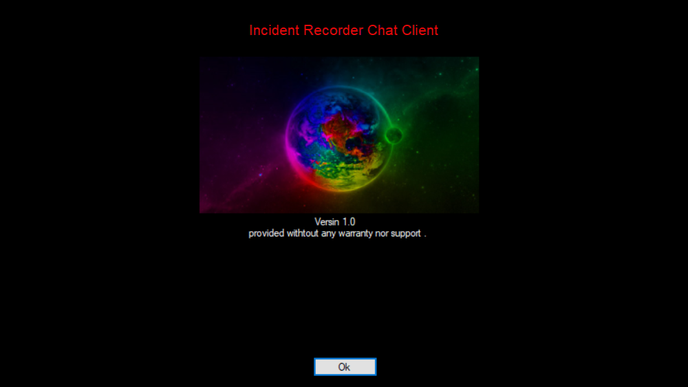

# Incident Recorder Chat program Stand-alone version.
## About
this program is a stand alone version of the incient recorder chat program. It was meant to be used in Security Incident Response teams as a alternate channel. the default port for the server is 570001. 
the server is set to answer on 0.0.0.0
the server also will not allow connections unless you define the users in the configuration. it also checks to see if the IP is in the connection list. If in the connection list of users
with a different IP, it will not allow the connection.  this is to prevent an attacker from eaves dropping the chat. I have been focusing on both client and server portions of the program. 
the intent after completion is to incorportate this into my Incident recorder program. this is not meant to be used outside of that function. Why? the program was designed to be used as an 
alternate commmunication method during an incident. the functions save all the files transmitted in the event into a single location. the amount of disk space used by files could become 
unruly quickly if used for weeks or months. I have not tested what would happen if the disk space was filled up with the program. A major improvement I plan to do is adding video chat.

Adding video chat will be tough so don't expect it to be released soon. 
this is released under the MIT license. Please respect the days of programming spent.

### Contributions welcome
if you feel so inclined, i am accepting contributions via paypal: paypal.me/theOneKennethRay 
